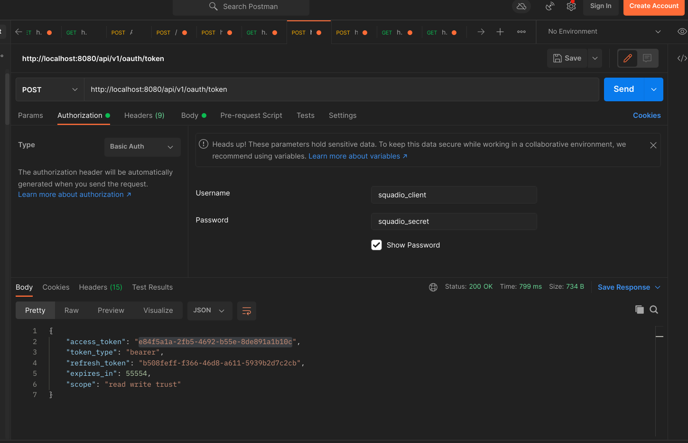
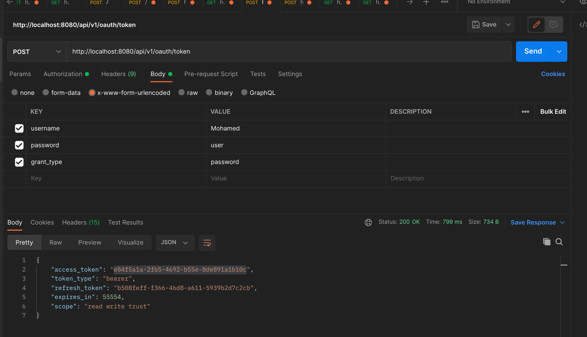
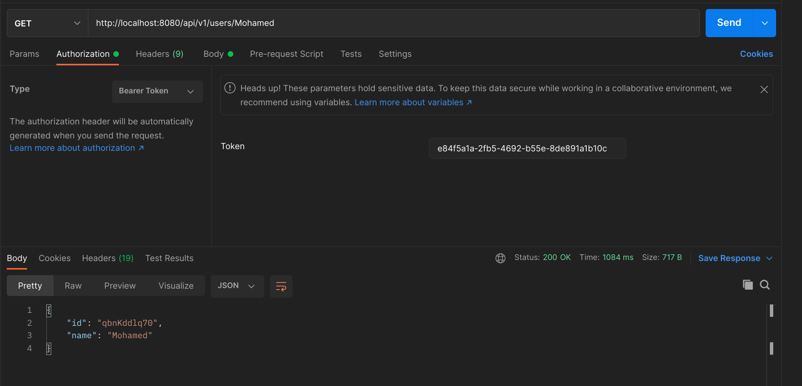
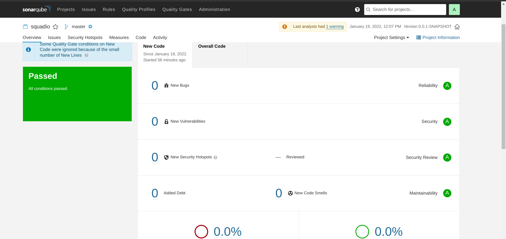

# squadio-test
This is SPRING BOOT PROJECT
The following steps below explains how to clone or download it from GITHUB and run it.

NB: Use Intellij IDEA

1. use this repository to clone the project https://github.com/bensonkar/squadio-test.git
2. Download intellij IDEA and import project
3. Wait for it to download dependencies then hit RUN button to start the project.The project will run on port 8080 with context path /api/v1
4. To test the APIs you need token. So you must login first. Use credential attached in the sent earlier .
5. The application uses spring security oauth token . To login navigate use this url http://localhost:8080/api/v1/oauth/token 
6. The login API requires basic authorization : provide these credentials: username = squadio_client and password = squadio_secret
7. Then provide the login payload as application/x-www-form-urlencoded with parameters: username,password,grant_type = password  as shown in the picture below
8. 
9. 
10. The access_token generated when login is successful will be passed as bearer token on authorization of APIs as shown below
11. 
12. Below is a screenshot of sonarqube results
13. 